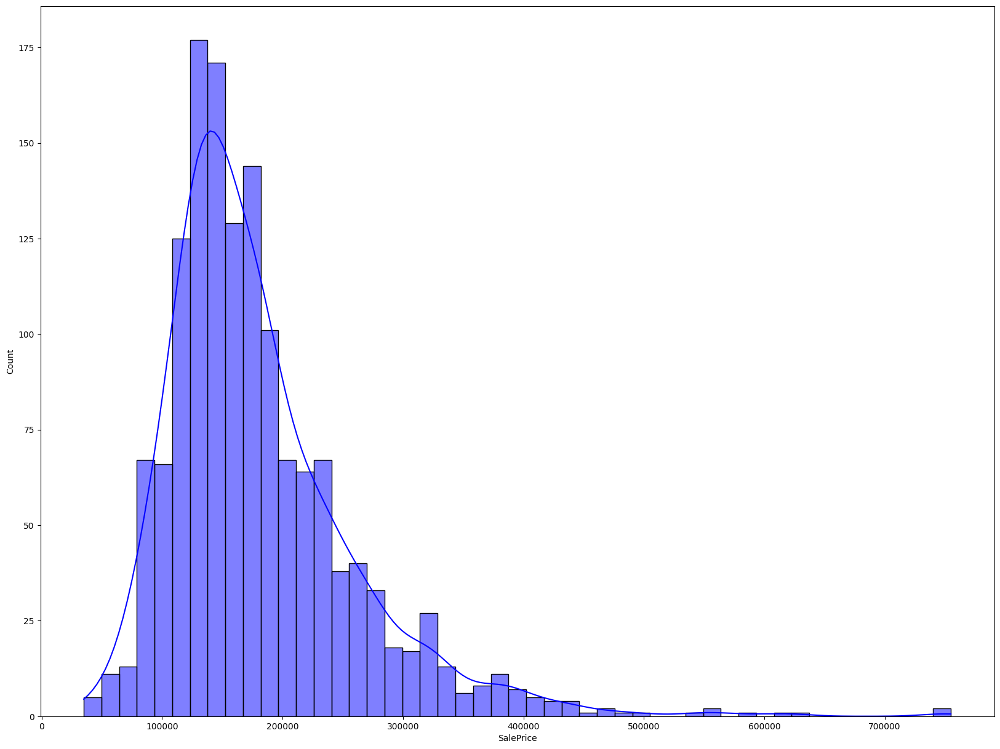

# Multi-task Learning Model for House Price Prediction and Classification

In this project,I built and evaluated a multi-task learning model that simultaneously predicts house prices, a regression task, and categorizes houses into predefined categories, a classification task. By leveraging multi-task learning and utilizing advanced features of PyTorch Lightning, I efficiently managed and optimized the learning process for these intertwined tasks.

## Problem Statement
The challenge of this project is two-fold: to predict the sale price of houses and to classify them into categories based on age, building type, and renovation status. The goal is to develop a predictive model that can handle multiple output variables and exploit commonalities and differences between tasks to improve prediction accuracy and model efficiency.

## Hypothesis
The integration of house characteristics, such as building type and renovation history, into a unified model can significantly enhance the prediction performance over separate models handling each task independently. This hypothesis is based on the premise that certain features will have shared influence across both regression and classification tasks, leading to more robust and generalizable predictions.

## Dataset
The dataset utilized in this analysis is the ["House Prices - Advanced Regression Techniques"](https://www.kaggle.com/c/house-prices-advanced-regression-techniques/data) from Kaggle. In addition to the original features, this project introduces a new categorical variable, 'House Category', derived from the 'House Style', 'Bldg Type', 'Year Built', and 'Year Remod/Add' features. The categorization is as follows:

- Houses renovated or built within the last 20 years are categorized as 'Modern'.
- Houses renovated or built within the last 50 years are classified as 'Contemporary'.
- Houses renovated or built within the last 100 years fall under 'Vintage'.
- Older houses are labeled as 'Historic'.

Additionally, houses are categorized based on building type and style into 'Family Home', 'Townhouse', and 'Multi-Family or Duplex', among others. The combination of age and type categories results in the comprehensive 'House Category' for each property. This enriched dataset provides a nuanced framework for the multi-task learning neural network to operate within.
# House Price Distribution

### Model Architecture

The final architecture of the multi-task learning model is designed to simultaneously handle regression and classification tasks. Here are the key components:

**Shared Feature Layers:**
- A linear layer that expands the input features to 64 dimensions, followed by batch normalization and ReLU activation.
- Another linear layer that reduces the dimensions to 32, also followed by batch normalization and ReLU activation.

**Task-Specific Heads:**
- **Price Head:** A linear reduction to 16 features, ReLU activation, and a final linear output layer for price prediction (regression).
- **Category Head:** Similar structure to the Price Head but concludes with a linear layer for multi-class output (classification).

**Loss Functions and Metrics:**
- Mean Squared Error Loss for regression.
- Cross-Entropy Loss for classification.
- Performance metrics include RMSE and R2 Score for regression and accuracy, precision, recall, and F1 score for classification.

**Uncertainty Balancing:**
- Incorporation of task uncertainty parameters (`log sigma squared price` and `log sigma squared category`) to dynamically adjust the contribution of each task's loss.
- This approach balances the learning process, improves convergence, and enhances generalization across both tasks.

## Performance on Holdout Set

| Metric            | Value     |
|-------------------|-----------|
| Test Accuracy     | 0.72      |
| Test Cat Loss     | 0.78      |
| Test F1 Score     | 0.70      |
| Test Loss         | 1.44      |
| Test Precision    | 0.71      |
| Test Price RMSE   | 45619.42  |
| Test R2 Score     | 0.67      |
| Test Recall       | 0.72      |

### Note:
- **RMSE (Root Mean Squared Error)** is used instead of MSE as it is more intuitive and penalizes large errors more effectively. MAE could have been used but does not penalize large errors.

For more details, please refer to the [project report file](https://github.com/Abdul-AA/Multitask-Learning-House-Price-and-Category-Prediction/blob/476991e53d2444001b4f6f9385e1e7f9a708202e/Report.pdf).
